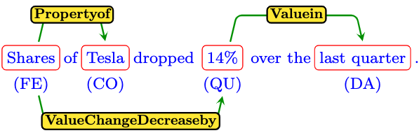

[](https://zenodo.org/badge/latestdoi/643674148)

# FIRE Dataset

The FIRE Dataset is a dataset of named entities and relations in the financial domain. Our paper "FIRE: A Dataset for FInancial Relation Extraction" is available at [arXiv](https://arxiv.org/abs/XXXX.XXXX).

## Description

FIRE features 13 types of entities and 18 types of relations and can be used to train and evaluate machine learning models in the task of financial joint named entity recognition and relation extraction.

Here is an example instance from the dataset and how it is represented in json format:
<p align="center">
  
</p>

```json
{
    "tokens": ["Shares","of","Tesla","dropped","14%","over","the","last","quarter"],
    "entities": [
        {"type": "FinancialEntity", "start": 0, "end": 1},
        {"type": "Company", "start": 2, "end": 3},
        {"type": "Quantity", "start": 4, "end": 5},
        {"type": "Date", "start": 7, "end": 9},
    ],
    "relations": [
        {"type": "propertyof", "head": 0, "tail": 1},
        {"type": "ValueChangeDecreaseby", "head": 0, "tail": 2},
        {"type": "Valuein", "head": 2, "tail": 3},
    ],
    "duration": 42,
}
```
Similar to the above example, each instance in the dataset contains four fields as follows:
- tokens: The raw text of the sentence represented as a list of tokens.
- entities: A list of named entities in the sentence. Each named entity is represented by a dictionary with keys: type (indicating the entity type), start and end, indicating the start(inclusive) and end(exclusive) token positions of the entity in the sentence.
- relations: A list of relations in the sentence. Each relation is represented by a dictionary with keys: type (indicating the relation type), head and tail (indicating the entity indices involved in the relation)
- duration: The time, in seconds, it took the human annotator to finish labeling this instance.
## Dataset Statistics

| Split  | # of Instances | # of Entity Mentions | # of Relation Mentions |
| ------ | -------------- | -------------------- | ---------------------- |
| Train  | 2,117          | 10,789               | 5,928                  |
| Dev    | 454            | 2,294                | 1,225                  |
| Test   | 454            | 2,251                | 1,213                  |

## Setup Instructions

To set up your Python environment to run the baselines, follow these steps:

1. Clone the repository:
```bash
git clone https://github.com/hmhamad/FIRE.git
cd FIRE
```
2. Install the required packages for the model you want to run:
  - For SPERT:
  ```bash
  pip install -r spert_requirements.txt
  ```
  - For PL-MARKER:
  ```bash
  pip install -r pl_marker_requirements.txt
  pip install --editable ./transformers
  ```
  - For REBEL:
  ```bash
  pip install -r rebel_requirements.txt
  ```
   You might face a bug when loading the REBEL model to evaluate on test set due to versioning conflicts. See this issue https://github.com/Babelscape/rebel/issues/55. The quick fix proposed from the author is to comment out the line in the pytorch_lighting source code: File "python3.8/site-packages/pytorch_lightning/core/saving.py", line 157, in load_from_checkpoint checkpoint[cls.CHECKPOINT_HYPER_PARAMS_KEY].update(kwargs)
## Reproducing Results

You can reproduce the results from our paper by running the the `main.py` file with the preset model configuration. A logging directory is then created under the `log` directory. Once training for all iterations is finished, the results are logged in a `mean_std_f1.csv` file.

For SpERT
```bash
python main.py --mode train --model spert
```
For PL-MARKER
```bash
python main.py --mode train --model pl_marker
```
For Rebel,
```bash
python main.py --mode train --model rebel
```

Each model has a configuration file under the 'configs' directory. You can set gpu_id, adjust hyper-parameters or change training configuration to run a different experiment. To reproduce the results in the paper using the FinBERT model, replace the `model_path` field with `ProsusAI/finbert` in the PL-Marker configuration file or replace the `model_path` and `tokenizer_path` fields with `ProsusAI/finbert` in the SpERT configuration file. This experiment does not apply to the REBEL model.
## Citing Our Work

If you use the FIRE Dataset in your research, please cite our paper:

```bibtex
@article{Hassan2023fire,
  title={FIRE: A Dataset for FInancial Relation Extraction},
  author={Hassan Hamad, Abhinav Thakur, Sujith Pulikodan, Nijil Kolleri and Keith M. Chugg},
  booktitle = "Findings of the Association for Computational Linguistics: NAACL 2024",
  year={2024}
}
```
